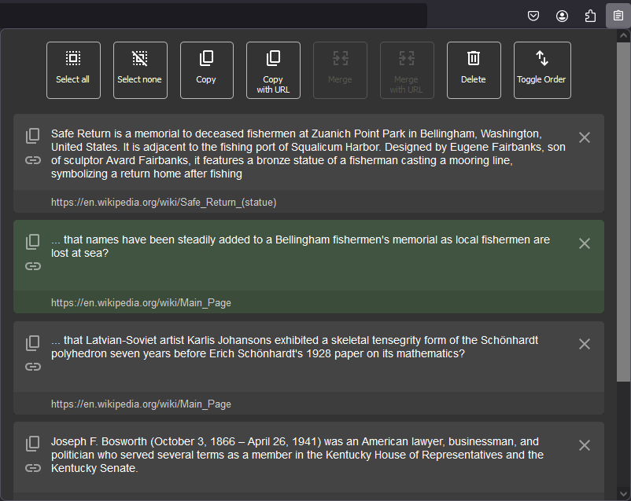
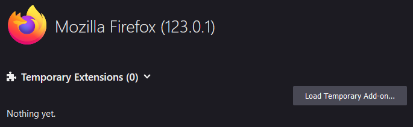
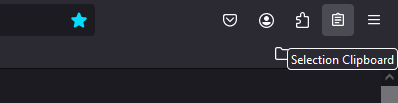
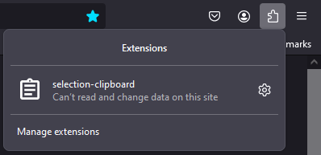
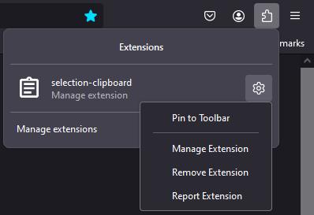

# Selection Clipboard (Firefox extension)

This extension adds a different text clipboard functionality to Firefox.
By selecting a text, the selected text is copied to the clipboard immediately and
added to the extension's selection history.

The selection history can be accessed by clicking the extension's icon in
the toolbar. You can sort, merge and combine texts from the history and copy them back to the system clipboard.

## Installation

The extension still in development stage and not yet published to the Firefox Add-ons site.
So, to install the extension, you need to follow these steps:

-   Clone the repository.
-   Open **Firefox** and enter `about:debugging#/runtime/this-firefox` in the address bar.
-   Click on **Load Temporary Add-on...**.\
    
-   Navigate to the extension's directory and select the `manifest.json` file.
-   The extension is now installed and the extension's icon is visible in the toolbar:
    

If the extension's icon is not visible in the toolbar:

-   Click on the **Extensions** button in the toolbar.\

-   Select the **Preferences** button next to the **Selection Clipboard** entry\
in the list of extensions.\

-   Click on the **Pin to Toolbar** button.\
    The extension's icon is now visible in the toolbar:\

